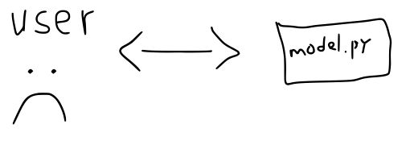
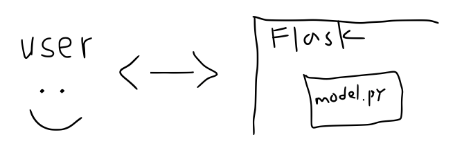
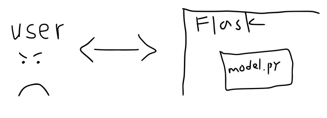
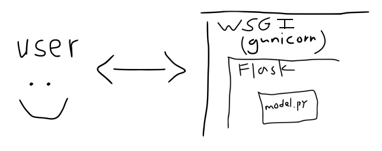
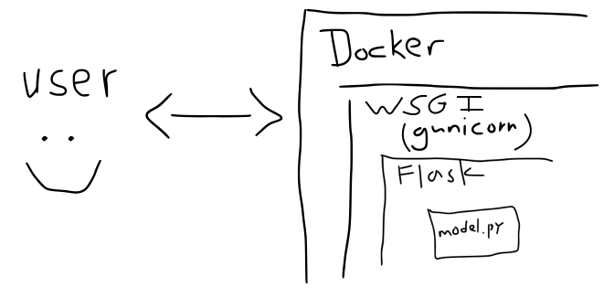
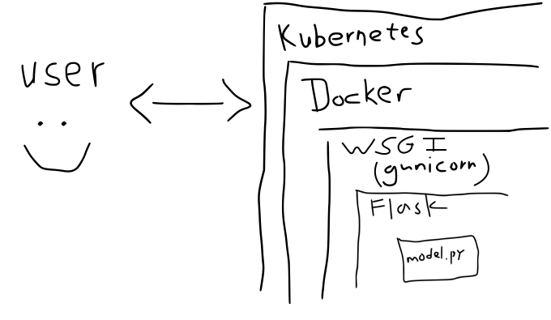
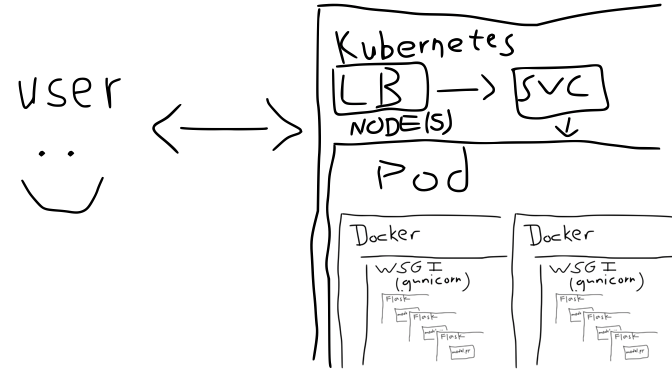

# A Beginner's Guide to Why You Should or Shouldn't Be Using Kubernetes for Machine Learning - With Illustrations

[Kubernetes](https://kubernetes.io/) is a powerful tool that receives a lot of hype which can sometimes make it seem intimidating. Perhaps you've wondered whether you should be using Kubernetes to deploy your machine learning applications but aren't sure where to start or even if it's the right move. If so, this post is for you. I'll try to start simple and work from the ground up to motivate the rationale for deploying models to Kubernetes.

# model.py

Our story starts with an app. For our purposes, assume this is just some Python code that imports `sklearn` (or whatever your preferred ML framework is) to make predictions. We want to expose this code to some users - specifically the ability to make predictions.

In some cases this might be enough to make our users happy. However, more often, in industry especially, this paradigm is undesirable. Drawbacks to this approach include requiring users to have access to the source code and to be able to run said Python code in order get predictions. If the source code is proprietary this is a non-starter and if users aren't comfortable running Python code or downloading the source and installing  dependencies then our situation is more like

# REST APIs

Having encountered this situation, exposing the model with a REST API - that is a URL where users can send data to and get predictions back over the internet - may be the next logical step. Under this paradigm users can programmatically get predictions using any language that speaks HTTP (i.e. pretty much all of them) and without needing to know any of the details about the source code or its implementation details (e.g. dependencies).

How do we proceed? Do we write our own HTTP library? No, we offload that responsibility to [flask](https://flask.palletsprojects.com/en/1.1.x/) (or whatever your preferred HTTP framework is).

Yet, this paradigm, too, is not without its downsides. flask [is not in the business of being a production grade server](https://flask.palletsprojects.com/en/1.1.x/tutorial/deploy/#run-with-a-production-server). This means if your API goes down, it stays down until someone starts it back up. Deploying upgrades requires stopping the running server and starting a new one. Once again, our situation is more like

# WSGI

What do we do now? Do we write a production grade server? No, we offload that responsibility to [gunicorn](https://gunicorn.org/) (or whatever your preferred [wsgi](https://wsgi.readthedocs.io/en/latest/what.html) framework is), and let it wrap our flask app and serve model predictions.

# But how do I install this thing?

At this point our humble `model.py` code has been wrapped in two layers, each with its own dependencies and complexity. Keeping track of all of these moving pieces can become cumbersome and, at this point, it's common to begin using containers to encapsulate all of the components.

# But how do I deploy this thing?

While containers are great at packaging applications, they don't provide solutions for deployment. Running containers shouldn't be exposed directly so we're back to where we were with running a single flask app.

What do we do now, write a container orchestration platform? No, we offload that responsibility to Kubernetes (or whatever your preferred container management services is).

Finally our users our happy again.

# Final Thoughts

Of course, that final statement was meant to be read with a bit of sarcasm. Kubernetes does provide many advantages but there's no free lunch here. We can only offload the complexities of deploying our app to yet-another-framework so many times.

In fact, while the illustrations above highlight the idea that each added layer encapsulates and overcomes the limitations of its predecessor they oversimplify the full set of complexities introduced by each layer by quite a bit.

In reality each gunicorn server is running one or more instances of our flask app. Just as Kubernetes is running one or more Pods, each running one or more containers, which are running the gunicorn servers, across one or more Kubernetes nodes. Needless to say the internet abounds with memes about the heartbreak of Kubernetes deployments.

Yet, many industries have adopted Kubernetes not without reason, some of which are

- Zero downtime deployments
- Monitoring of the app's health, starting up new instances on failure
- Horizontal scaling and load balancing
- Packaging apps with dependencies
- Configurations
- And much, much more!

Note that not all of these advantages center on scaling an app to a zillion users. High availability and zero-downtime deployments are necessary components of any high quality API.

Is Kubernetes right for you? It depends on your situation. There are plenty of alternatives, with each of the big cloud providers offering their own (e.g. [tensorflow serving on GKE](https://www.tensorflow.org/tfx/serving/serving_kubernetes), [Amazon Sagemaker](https://aws.amazon.com/sagemaker/)). And even if you want to try kicking the can of responsibility further down the road you have choices such as [kubeflow](https://www.kubeflow.org/docs/about/kubeflow/) and [seldon](https://www.seldon.io/).
